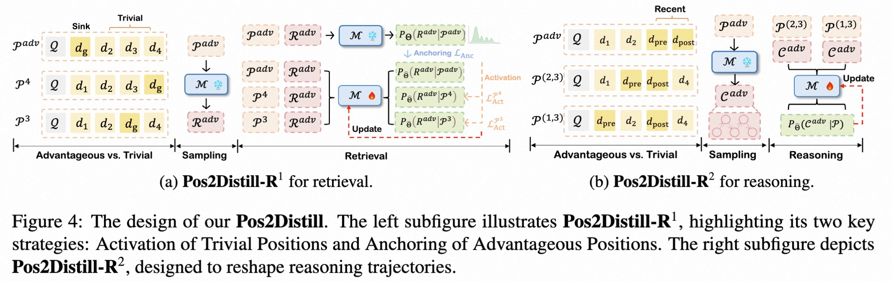

<p align="center">
  <h1 align="center">POSITION BIAS MITIGATES POSITION BIAS: Mitigate Position Bias Through Inter-Position Knowledge Distillation</h1>
  <p align="center">
    <a href="https://www.arxiv.org/abs/2506.17218">
      
    </a>
  </p>
</p> 


We propose **Pos2Distill**, a novel position to position knowledge distillation framework, transferring knowledge from advantageous positions to rectify responses at unfavorable ones, therefore mitigating position bias naturally.

<details open="open" style='padding: 10px; border-radius:5px 30px 30px 5px; border-style: solid; border-width: 1px;'>
  <summary>Tabel of Contents</summary>
  <ol>
    <li>
      <a href="#installation">Installation</a>
    </li>
    <li>
      <a href="#data-preparation">Data Preparation</a>
    </li>
    <li>
      <a href="#training">Training</a>
    </li>
    <li>
      <a href="#inference">Evaluation</a>
    </li>
    <li>
      <a href="#citation">Citation</a>
    </li>
    <li>
      <a href="#acknowledgement">Acknowledgement</a>
    </li>
  </ol>
</details>

## News
- [2025-11-03] We have released our test code, data, and model weights for Pos2Distill.

## Installation
Create a conda environment and install the required packages:
```bash
conda create -n pos2distill python=3.10
conda activate pos2distill

git clone https://github.com/AMAP-ML/Pos2Distill.git
cd Pos2Distill
pip install -r requirements.txt
```
Our knowledge distillation freamwork is based on [OpenRLHF](https://github.com/OpenRLHF/OpenRLHF), an open-source RLHF framework.
```bash
pip install openrlhf==0.6.1.post1 
```
## Data Preparation
We provide a NaturalQuestions (20docs) in [google drive]():
- Firstly, we need to generate high quality responses from advantagous positions through **gen_advantageous_pos_for_R1.sh**, the resulting responses are saved in raw_data/$dataset_name directory.
- Second, we need construct advantagous-trivia pairs for knowledge distillation in the training stage:
  - example_num: how many different datapoints are used;
  - position_sample_num: how many trivial positions are sampled.
  ```bash
  model_name=Mistral-7B-Instruct-v0.3
  dataset_name=nq
  python create_datasets.py \
          --model_name $model_name \
          --position_sample_num 4 \
          --example_num 400 \
          --dataset_name $dataset_name
  ```

## Training
We train our model through the script train_nq.sh: kd_coef controls which training approach you choose, "0.0,0.0,0.0,1.0" means you train models through Pos2Distill.
```bash
kd_coef="0.0,0.0,0.0,1.0"
deepspeed --master_port 6666 \
              kd/train_kd.py \
          --max_len 32000 \
          --dataset ${model_name}_${total_docs}total_docs_filter_${K}random_${strengthen}strengthen_${num}\
          --input_key question \
          --output_key oracle_answer \
          --train_batch_size 32 \
          --micro_train_batch_size  4 \
          --max_samples 500000 \
          --pretrain $model_name \
          --teacher_model $model_name \
          --save_path checkpoints/${dataset_name}\
          --save_steps -1 \
          --logging_steps 1 \
          --eval_steps -1 \
          --zero_stage 3 \
          --max_epochs 1 \
          --l2 0.01 \
          --bf16 \
          --flash_attn \
          --kd_coef $kd_coef \
          --learning_rate 3e-6 \
          --teacher_offload \
          --apply_chat_template \
          --gradient_checkpointing  \
          --perserve 1.0 \
          --dataset_name $dataset_name \
          --use_tensorboard tensorBoard
```
## Evaluation

1. Currently, the model weights are saved in checkpoints directory. You can run the test code (eval_data.sh) using the command below to evaluate the
   performance of Pos2Distill on NaturalQuestion datasets.
  ```bash
  total_docs=20
  num_gpus=8
  INPUT_PATH="nq-open-${total_docs}_total_documents.jsonl.gz"
  random_num=4
  strengthen=1
  model_name=Mistral-7B-Instruct-v0.3_20total_docs_filter_4random_1strengthen_400_kd0.0_lm0.0_rank0.0_adaptive1.0_1.0
  python eval_data.py \
          --input-path "$INPUT_PATH" \
          --model $model_name \
          --output-path evaluate \
          --sample_num 500 \
          --max-prompt-length 32768 \
          --max-new-tokens 100 \
          --num_gpus "$num_gpus" \
          --total_doc "$total_docs" 
  ```
2. If you want evaluate Pos2Distill on webq datasets (20 docs), run code below:
   ```bash
   INPUT_PATH="webq_dev.jsonl.gz"
   python eval_data.py \
          --input-path "$INPUT_PATH" \
          --model $model_name \
          --output-path evaluate \
          --sample_num 500 \
          --max-prompt-length 32768 \
          --max-new-tokens 100 \
          --num_gpus "$num_gpus" \
          --total_doc "$total_docs" 
   ```
3. If you want evaluate Pos2Distill on tqa datasets (20 docs), run code below:
   ```bash
   INPUT_PATH="tqa_dev.jsonl.gz"
   python eval_data.py \
          --input-path "$INPUT_PATH" \
          --model $model_name \
          --output-path evaluate \
          --sample_num 500 \
          --max-prompt-length 32768 \
          --max-new-tokens 100 \
          --num_gpus "$num_gpus" \
          --total_doc "$total_docs" 
   ```

## Acknowledgement
We would like to thank the following works for their code and models:
- Training: [OpenRLHF](https://github.com/OpenRLHF/OpenRLHF), [TRL](https://huggingface.co/docs/trl/sft_trainer)
- Datasets: [NaturalQuestions](https://github.com/nelson-liu/lost-in-the-middle), [TQA](https://huggingface.co/datasets/vsearch/tqa), [WEBQA](https://huggingface.co/datasets/vsearch/webq)

We are extremely grateful to  **Linjing Li**, **Yong Wang**, **Xiangxiang Chu** and many other friends in our Machine Learning Group for their helpful feedback and insightful discussions.

## Citation
If you feel this project is helpful, please consider cite our report :blush:. If you have any question about us, please contact the email: [Yifei Wang](https://scholar.google.com/citations?hl=zh-CN&user=AHD4c24AAAAJ).
```bibtex
@article{wang2025position,
  title={Position Bias Mitigates Position Bias: Mitigate Position Bias Through Inter-Position Knowledge Distillation},
  author={Wang, Yifei and Xiong, Feng and Wang, Yong and Li, Linjing and Chu, Xiangxiang and Zeng, Daniel Dajun},
  journal={arXiv preprint arXiv:2508.15709},
  year={2025}
}
```
